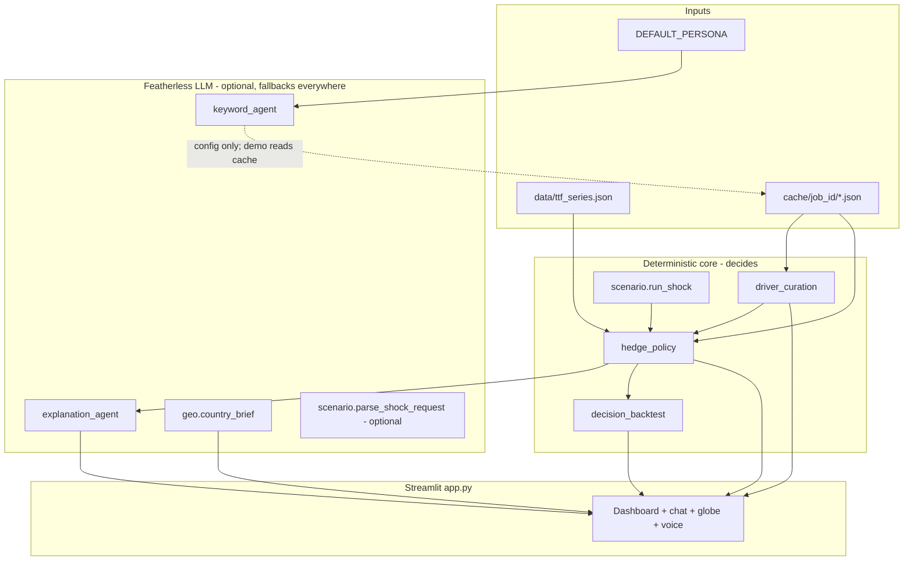

# TTF Gas Hedging Agent — Application Guide

A plain-English guide to what this app does, **how we know its forecasts and
decisions are any good**, and **what every section of the dashboard is for**. If
you're a judge, a teammate, or future-you opening this cold, start here.

> **Companion docs:** `docs/ARCHITECTURE.md` explains *why* each design choice was
> made; `CLAUDE.md` (repo root) is the operational state/handoff for continuing the
> work. This guide is the "how it works and how to read it" reference.

---

## Table of contents

1. [What problem this solves](#1-what-problem-this-solves)
2. [The 30-second version](#2-the-30-second-version)
3. [How do we know the forecast and the decision are good?](#3-how-do-we-know-the-forecast-and-the-decision-are-good)
4. [The golden rule: who decides what](#4-the-golden-rule-who-decides-what)
5. [The base scenario (calm case)](#5-the-base-scenario-calm-case)
6. [End-to-end pipeline](#6-end-to-end-pipeline)
7. [Dashboard walkthrough — what each section does](#7-dashboard-walkthrough--what-each-section-does)
8. [The hedge policy in plain English](#8-the-hedge-policy-in-plain-english)
9. [Driver curation](#9-driver-curation)
10. [Live scenario / supply shock](#10-live-scenario--supply-shock)
11. [Decision backtest](#11-decision-backtest)
12. [Voice narration](#12-voice-narration)
13. [The driver globe](#13-the-driver-globe)
14. [Module reference](#14-module-reference)
15. [Data files and cache layout](#15-data-files-and-cache-layout)
16. [External services and configuration](#16-external-services-and-configuration)
17. [How to run locally](#17-how-to-run-locally)
18. [Tests and quality](#18-tests-and-quality)
19. [Current limitations (honest caveats)](#19-current-limitations-honest-caveats)
20. [Glossary](#20-glossary)

---

## 1. What problem this solves

**Who:** an energy-intensive EU buyer — by default a **mid-size German glass &
ceramics manufacturer** whose largest volatile cost is natural gas.

**Market:** the Dutch **TTF** (Title Transfer Facility), the benchmark wholesale gas
price for continental Europe, in **EUR/MWh**.

**The decision, every quarter:**

> *What share of next quarter's gas should we **lock in forward** now, versus leave
> to buy later on the **spot** market?*

That share is the **hedge ratio** (0% = all spot, 100% = fully locked). The app does
**not** try to predict the exact price — Sybilion's point forecast is weak here
(around **28% MAPE**). Instead it decides on:

- the forecast's **confidence band** (how *sure* the model is), which is the part of a
  weak forecast that's still informative;
- the **drift** of the forecast median vs today's spot;
- a **curated set of external drivers** (what plausibly moves gas, with the spurious
  correlations thrown out);
- optional **supply-shock** adjustments from the live scenario.

---

## 2. The 30-second version

```
Featherless picks Sybilion filters
  → Sybilion returns the forecast + ranked drivers
  → curation drops the spurious drivers
  → a deterministic policy sets the hedge ratio
  → Featherless explains the decision it did not make
  → (live) a supply-shock headline re-runs the whole thing on shocked inputs
```

With the current cached forecast, today's spot is about **€47/MWh** and the calm
**next-quarter hedge ratio is ~26%** — lock about a quarter of next quarter's volume
forward now, keep the rest on spot. Type *"Iran closes the Strait of Hormuz"* into the
sidebar and that ratio **rises**, the price band widens, and the driver mix re-ranks —
all from the same deterministic policy, live.

---

## 3. How do we know the forecast and the decision are good?

This is the question the whole design answers, so it's worth being explicit. We make
**four** distinct claims, each backed by something on screen:

### (a) We don't trust the point forecast — and we say so

The dashboard shows the forecast's **backtest MAPE (~28%)** right at the top, labelled
as *weak on purpose*. We're not hiding it: the entire approach exists *because* the
midpoint is unreliable. The decision is built on the **uncertainty band**, not the
point — so a wrong midpoint doesn't sink the decision.

### (b) The decision beats the naive baselines — measured, not asserted

The **"Did the decision beat the naive baselines?"** panel replays the *exact same*
hedge policy over Sybilion's historical backtest windows (**63 replayed months** on the
current job) and compares realized cost against two dumb strategies:

- **Always buy spot** (hedge 0%) — do nothing.
- **Always lock 50%** — a mechanical static hedge.

Result on the cached job: the policy is **€1.25/MWh cheaper** than always-spot **and**
runs a **€2.34/MWh tighter cost swing**, while **matching** a static 50% lock
(policy €35.71 ± 4.47; spot €36.96 ± 6.81; lock-50% €35.25 ± 4.35). The headline win
is **variance reduction** — a steadier gas bill — which is the entire reason a factory
hedges. We lead with that because it's the honest, defensible win, and we don't
overclaim on average cost (in a falling market, nothing beats pure spot on cost alone).

### (c) The reasoning is fully traceable — you can audit it by hand

Every number that goes into the ratio is exposed in the **"How each month's decision
was reached"** table: band width, forward-vs-spot drift, the band component, the drift
tilt, and the final clamped ratio, plus a one-line `reason`. No black box: the math is
a transparent linear map you can re-compute yourself. And the LLM **never** sets the
ratio — it only narrates a number that's already fixed (see [§4](#4-the-golden-rule-who-decides-what)).

### (d) It separates real signal from coincidence — visibly

The **driver curation** panel shows Sybilion's ranked drivers split into **kept**
(credible) vs **rejected** (spurious) — currently **25 kept / 6 rejected**. You can
see it throw out "Population — Sri Lanka" while keeping "Exports of Natural gas in
Europe." Acting on spurious correlations is the classic forecasting trap; the app shows
you it isn't falling into it.

### (e) It adapts correctly when the world changes

Type a supply-shock headline and the ratio **rises** (you lock more tail insurance) —
which is the economically *correct* direction for a supply shock, and it happens
through the same deterministic policy, so it's reproducible.

---

## 4. The golden rule: who decides what

The architectural principle repeated throughout the code:

| Component | Role | Sets the hedge ratio? |
|-----------|------|-----------------------|
| **Sybilion API** | Probabilistic forecast + driver ranking | No |
| **Keyword agent** (`keyword_agent.py`) | Picks Sybilion filters from the persona | No |
| **Driver curation** (`driver_curation.py`) | Keeps/rejects drivers by name rules | No |
| **Hedge policy** (`hedge_policy.py`) | **Computes the ratio** from band + drift + premium | **Yes** |
| **Scenario engine** (`scenario.py`) | Classifies shocks; bumps the *inputs* | No (changes inputs only) |
| **Explanation agent** (`explanation_agent.py`) | Natural-language "why" | No |
| **Geo briefs** (`geo.py`) | Country-level explanation | No |

> **LLMs prepare and narrate; deterministic code decides.** This is what makes the
> decision reproducible, auditable, and its explanations trustworthy.

---

## 5. The base scenario (calm case)

When you open the dashboard with **no active shock** (`shock_magnitude == 0`), you're
in the **calm base case**, driven entirely by cached real data:

| Input | Source |
|-------|--------|
| Historical TTF prices (the spot anchor) | `data/ttf_series.json` (Yahoo `TTF=F`, monthly close) |
| Probabilistic forecast | Cached Sybilion job `forecast.json` |
| Ranked drivers | Cached `external_signals.json` |
| Forecast accuracy metric (MAPE) | Cached `backtest_metrics.json` |
| Policy-replay history | Cached `backtest_trajectories.json` |

**Calm flow:** load the latest job (`cache/latest_job.txt` →
`f445eec1-62e2-43e1-9995-18ba7ee668c3`) → show the filters the keyword agent picked →
curate the drivers → the policy sets a hedge ratio per forecast month (2026-06 …
2026-11) → headline = the average over the **first three months** ("next quarter") →
the explanation agent narrates it → the backtest panel proves it beats the baselines →
the globe maps the drivers to countries.

Current calm result: spot **€47.28/MWh**, next-quarter ratio **~26%** (per-month:
46% / 10% / 22%).

---

## 6. End-to-end pipeline



**Demo path:** artifacts are pre-fetched from Sybilion (via API/MCP during dev) into
`cache/<job_id>/`, and the dashboard reads the cache, so demos work with **no live
polling**. **Live path (available, off by default):** `SybilionClient` can
`submit_forecast` → poll → fetch; the UI keeps this off on stage except a "re-pick
filters" toggle that only re-runs the keyword agent.

---

## 7. Dashboard walkthrough — what each section does

Run it with `uv run streamlit run app.py`. Top to bottom:

1. **Title + pipeline caption** — states the LLM-vs-deterministic split up front.
2. **Metrics row (3 tiles)** —
   - *Lock now — next quarter*: the headline hedge ratio (and, under a shock, the delta
     vs calm).
   - *vs naive baselines*: a reminder of what we're beating (0% spot / 50% lock).
   - *Forecast point-accuracy (backtest MAPE)*: ~28%, flagged as *weak on purpose* —
     which is why we decide on the band, not the point.
3. **"Step 1 — how the agent configured the forecast"** (expander) — the Sybilion
   **categories, regions, and keywords** the keyword agent selected, plus its source
   (LLM or fallback) and recency factor. This is the "agent set up its own data
   request" step made visible.
4. **Two charts side by side:**
   - *Probabilistic price forecast* — TTF history (grey) + the forecast median (blue
     dashed) inside its **80% and 90% confidence bands**. Today's spot is the amber
     dotted line. The width of the shaded band *is* what drives the decision.
   - *The decision — hedge ratio per month* — bars of the per-month lock %, with the
     "naive lock 50%" line for reference. Bars are green when the forward is rising vs
     spot, blue otherwise.
5. **"Did the decision beat the naive baselines?"** — the backtest bar chart (mean
   realized cost per strategy, with **whiskers = cost volatility**), three metric
   tiles (cheaper-than-spot, steadier-than-spot, vs 50% lock), and the one-line
   **verdict**. This is the proof the decision isn't arbitrary. See [§11](#11-decision-backtest).
6. **"Why — the agent's explanation"** — a plain-language paragraph from Featherless
   (or a deterministic template) explaining *why* this ratio, citing the real driver
   names and band/drift numbers. A caption names the model and reminds you it
   *explains, never decides*. Below it, an optional **voice narration** player.
7. **"Driver curation — what the agent trusted vs threw out"** — a horizontal bar chart
   of **kept (green)** vs **rejected (red)** drivers by importance, plus a table of the
   dropped ones with the reason each was dropped. See [§9](#9-driver-curation).
8. **"Where the drivers live — the agent's world view"** — a drag-spinnable **globe**:
   green markers for trusted suppliers/hubs (bigger = more kept importance), red
   markers for spurious-only countries. Click a marker (or use the dropdown) for a
   Featherless brief on *why* that country does (or doesn't) move European gas. See
   [§13](#13-the-driver-globe).
9. **"How each month's decision was reached"** — the full audit table: median, band
   width, forward-vs-spot drift, band component, drift tilt, final ratio, and the
   `reason` string. This is the traceability guarantee in one table.

**Sidebar — "Live scenario"** — the chat + buttons that drive the supply-shock
scenario. See [§10](#10-live-scenario--supply-shock).

---

## 8. The hedge policy in plain English

**Question per month:** how much to lock forward? **Inputs:** the median (q50), the
band edges (q10/q90), today's spot, and an optional shock risk-premium (0 when calm).

1. **Band width** = `(q90 − q10) / median`.
   - *Narrow* band → the model is confident → **lock more**.
   - *Wide* band → uncertain → **keep optionality, lock less**.
2. **Drift** = `(median − spot) / spot`.
   - Forward *above* spot → buying later looks more expensive → **tilt toward locking**.
   - Forward *below* spot → **tilt away**.
   - This tilt is **capped** (±30%) so the unreliable midpoint can nudge but never
     dominate.
3. **Add them up, then clamp** to a floor and cap (**10%–90%**): never lock nothing,
   never lock everything.
4. **Risk premium** (shock only): an additive bump onto the floor — tail insurance.

**Why these thresholds?** `low_band` (0.30) and `high_band` (1.10) are **calibrated to
this series' own backtest band widths** — "tight" and "wide" mean tight/wide *relative
to what this model actually produces*, not arbitrary numbers. Each month yields a
`MonthDecision` carrying every component plus a human-readable `reason`, which is what
the audit table and the explanation are built from.

*(Full formula and rationale in `docs/ARCHITECTURE.md` §4.1.)*

---

## 9. Driver curation

Sybilion ranks driver series by **in-sample correlation**, which inevitably surfaces
**spurious** matches (population, tourism, …) that track gas by coincidence, not cause.
Curation is the agent's domain judgment, made explicit and **100% rule-based on driver
names** (so it's reproducible and auditable):

1. **Reject** if the name contains a spurious keyword (`population`, `fertility`,
   `mortality`, `tourism`, …). *Checked first*, so nothing demographic sneaks through.
2. **Keep** if the name matches an energy/markets theme (`natural gas`, `LNG`,
   `electricity`, oil, coal/carbon, FX, rates, commodities, …).
3. **Keep** energy-related import/export/trade flows (and trade indices as a demand
   proxy).
4. **Else reject** as outside the whitelist.

Region is parsed from the name for the globe/display only (not for keep/reject). If
fewer than **8** credible drivers survive (`needs_refine`), the keyword agent can widen
its filters and re-pull (the closed loop). On the current job: **25 kept / 6 rejected**.

---

## 10. Live scenario / supply shock

**Purpose:** answer "what if the assumption shifts mid-quarter?" — e.g. *Iran closes
the Strait of Hormuz*. This is the adaptivity axis.

**Sidebar controls (`scenario_sidebar`):**

- **⚡ Strait of Hormuz** button — fires the canonical full-severity shock (magnitude 1.0).
- **Reset to calm** — back to the base case.
- **"Let Featherless classify the message"** toggle — optional LLM shock parser vs the
  default deterministic keyword parser. *Either way the LLM only reads severity, never
  the ratio.*
- **"Free-form re-forecast"** toggle — a non-shock message re-runs the keyword agent to
  reconfigure Sybilion (no live poll on stage).
- **Chat input** — type a headline; the app parses it, updates state, and re-renders.

**When a shock is active, `scenario.run_shock`:**

| Effect | Mechanism |
|--------|-----------|
| Higher forward prices | `apply_shock` scales the median up (`median_bump × magnitude`) |
| Wider uncertainty | stretches q10/q90 around the median (`band_widen × magnitude`) |
| Higher lock floor | a `risk_premium` (up to +25%) added in `decide_all` — tail insurance |
| Different driver story | `shocked_curation` boosts Iran/Qatar/Russia/Algeria and injects a synthetic "Global supply-risk premium" driver at the top |
| Consistent charts | `shock_forecast_json` rewrites every quantile so the price band redraws to match |

**Net effect:** the hedge ratio **rises** — economically correct, because a supply
shock skews risk to the upside, so you lock *more* now even though the forecast got
murkier. Every panel below the banner is the *same deterministic policy* re-run on the
shocked inputs.

---

## 11. Decision backtest

**Goal:** prove the policy isn't arbitrary by replaying it over Sybilion's historical
backtest windows and comparing **realized cost** against naive baselines.

| Strategy | Hedge ratio | Cost per month |
|----------|-------------|----------------|
| Agent policy | from `decide_month` | `ratio × lock_price + (1−ratio) × actual` |
| Always spot | 0% | `actual` |
| Always lock 50% | 50% | `0.5 × lock_price + 0.5 × actual` |

**The key honest assumption:** `lock_price` = the **spot at decision time** (the actual
price the month *before* each window starts), **not** the forecast median. Why?
Locking at the median would be betting on the weak point forecast — the exact thing
this agent refuses to do. The forecast only *sizes* the ratio; the price you pay to
lock is the market's. This assumption is stated in the UI, not hidden.

**On the dashboard:** the bar chart (whiskers = volatility), three metric tiles, and the
verdict line. **Current verdict (63 months):** policy **€1.25/MWh cheaper** than spot,
**€2.34/MWh tighter** swing, **matches** a 50% lock. The win we lead with is the
variance reduction — the reason a factory hedges at all.

Run it standalone: `uv run python -m gas_agent.decision_backtest`.

---

## 12. Voice narration

The explanation paragraph can be **read aloud**. It's an optional, additive feature —
the dashboard is unaffected if it's off.

- **Providers, in order:** **NVIDIA Riva** (gRPC, the primary real TTS) → **local OS
  voice** (macOS `say`, the always-available fallback). *Featherless is text-only — it
  has no TTS endpoint — so it is never used for voice.*
- **Rate limiting:** a 60-second sliding-window limiter guards NVIDIA's free tier
  (~40 req/min); over the limit (or on a 429) it routes to the local engine.
- **Pre-synthesised clips:** `scripts/build_voiceover.py` writes
  `cache/audio/golden.wav` and `shock.wav` (with JSON sidecars recording the real
  provider/voice), so the on-stage player is **instant** and the live limit is
  essentially never hit during a demo.
- **Graceful absence:** if no provider is reachable, the player simply hides.
- The caption always names the provider/voice actually used, and reminds you it's
  *voicing the explanation, not deciding it*.

Regenerate the clips: `uv run python scripts/build_voiceover.py`.

---

## 13. The driver globe

A drag-spinnable **orthographic globe** (Plotly `Scattergeo`) that makes the
kept-vs-rejected split *spatial*:

- **Green markers** = credible suppliers/hubs (Norway, Netherlands, Germany, Russia,
  Qatar, …), sized by summed kept importance.
- **Red markers** = countries that only showed up through spurious correlations
  (Sri Lanka, Serbia, Bangladesh).
- **Click a marker** (or use the dropdown) → a short Featherless brief on why that
  country does (or doesn't) move European gas, plus its kept/dropped driver names.
- Under a shock, the **risk supplier lights up** (Iran appears/grows green).

Plotly ships the country geometry, so there's **no external basemap to fetch** — it
can't fail on stage. (An earlier pydeck version did rely on a CDN and rendered flat;
this replaced it.)

---

## 14. Module reference

| Path | Responsibility |
|------|----------------|
| `app.py` | Streamlit UI: charts, metrics, sidebar scenario chat, globe, voice |
| `gas_agent/config.py` | Env vars, paths, API keys, `have_*_key()` helpers |
| `gas_agent/llm.py` | Featherless (OpenAI-compatible) client + graceful fallback |
| `gas_agent/catalog.py` | Sybilion category/region IDs + credibility whitelist |
| `gas_agent/keyword_agent.py` | LLM → Sybilion filter selection (selects, never invents) |
| `gas_agent/driver_curation.py` | **Deterministic driver keep/reject** (the edge) |
| `gas_agent/hedge_policy.py` | **Hedge-ratio engine** (the core) |
| `gas_agent/scenario.py` | Supply-shock classification + deterministic shock math |
| `gas_agent/explanation_agent.py` | LLM narrative of the fixed decision |
| `gas_agent/decision_backtest.py` | Historical policy replay vs baselines |
| `gas_agent/geo.py` | Country aggregation + globe coords + per-country briefs |
| `gas_agent/sybilion_client.py` | REST client + cache I/O + forecast parsers |
| `gas_agent/voice.py` | TTS router: NVIDIA primary + rate limiter + local fallback |
| `scripts/build_ttf_series.py` | Regenerate `data/ttf_series.json` from Yahoo |
| `scripts/save_cached_artifact.py` | Import an MCP-exported artifact into the cache |
| `scripts/build_voiceover.py` | Pre-synthesise the narration clips |
| `tests/` | 82 deterministic, offline unit tests |

---

## 15. Data files and cache layout

```
hackathon/
├── app.py                          # Streamlit entrypoint
├── data/
│   └── ttf_series.json             # committed TTF history (the spot anchor)
├── cache/
│   ├── latest_job.txt              # → active Sybilion job UUID
│   ├── <job_id>/                   # cached real artifacts (gitignored *.json)
│   │   ├── forecast.json           # quantile forecast per month
│   │   ├── external_signals.json   # ranked external drivers
│   │   ├── backtest_metrics.json   # MAPE etc.
│   │   └── backtest_trajectories.json  # historical replay windows
│   └── audio/                      # pre-synthesised narration (gitignored, regenerable)
├── sybilion_forecast/              # reference copies of artifacts + input.json payload
├── .env.example                    # API keys, model names, voice config
└── pyproject.toml                  # Python ≥3.11, uv-managed deps
```

**`forecast.json` shape (simplified):**
`data.forecast_series[<month>].quantile_forecast` has keys `"0.05"`, `"0.10"`,
`"0.50"`, `"0.90"`, `"0.95"`, plus an optional `forecast` point estimate.
**`external_signals.json`:** driver entries with `driver_name`, `importance`,
`pearson_correlation`.

---

## 16. External services and configuration

Copy `.env.example` → `.env`:

| Variable | Purpose |
|----------|---------|
| `SYBILION_API_KEY` / `SYBILION_BASE_URL` | Sybilion forecast API (optional for cache-only demo) |
| `FEATHERLESS_API_KEY` / `FEATHERLESS_BASE_URL` | LLM for keyword/explanation/geo/optional shock classify |
| `KEYWORD_MODEL` | Filter picker (default Mistral-Small-3.2) |
| `EXPLANATION_MODEL` | Narratives (default Mistral-Large) |
| `VOICE_PROVIDER` | `auto`/`nvidia` (prefer NVIDIA, fall back to local) or `local` |
| `NVIDIA_*` | NVIDIA Riva TTS (key, Riva gRPC URI, function id, voice, RPM limit) |
| `LOCAL_TTS_VOICE` | Local OS voice name (empty = system default) |

- **Without Featherless:** keyword, explanation, and country briefs use deterministic
  fallbacks; the app still runs on cache.
- **Without Sybilion:** the app runs as long as `cache/<job_id>/` exists and
  `latest_job.txt` points to it.
- **Without any TTS:** the voice player simply hides.

---

## 17. How to run locally

**Prerequisites:** Python ≥ 3.11, [uv](https://github.com/astral-sh/uv).

```bash
cd /path/to/hackathon
uv sync
cp .env.example .env          # optional: add Featherless / Sybilion / NVIDIA keys
uv run streamlit run app.py   # the dashboard
```

Other useful commands:

```bash
uv run pytest -q                              # 82 tests
uv run python -m gas_agent.decision_backtest  # offline backtest verdict
uv run python scripts/build_ttf_series.py     # regenerate the TTF series from Yahoo
uv run python scripts/build_voiceover.py      # regenerate the narration clips
```

If the dashboard says *"No cached forecast found"*, ensure
`cache/<uuid>/forecast.json` exists and `cache/latest_job.txt` points to that UUID.

---

## 18. Tests and quality

- **82 tests pass** (`uv run pytest`).
- Coverage spans the decision-critical logic: the hedge policy, driver curation, the
  shock scenario, the decision backtest, geo aggregation, LLM JSON handling, and the
  voice router + rate limiter.
- All tests are **deterministic and offline** — no network, no live model or TTS call
  (backends are monkeypatched). The Streamlit UI itself is not unit-tested (it's
  verified by running it).

---

## 19. Current limitations (honest caveats)

These are deliberate scope choices, not bugs:

- **Lock-price proxy = decision-time spot.** The backtest assumes you lock at the spot
  at decision time, because the artifacts carry no historical forward curve. Stated in
  the UI; a real forward curve would sharpen it.
- **No live Sybilion poll on the main path** (for demo speed/reliability). The REST
  client supports submit→poll→fetch; only the "re-pick filters" toggle re-runs the
  keyword agent live.
- **Curation is name-rule based.** It keys off driver names; `catalog.py` also has
  category/region credibility helpers the curation step doesn't currently use
  (a possible future unification).
- **Voice is best-effort and macOS-leaning** for the offline fallback (`say`). With an
  NVIDIA key it uses Riva anywhere; with neither, the player hides. Pre-synthesised
  clips keep the demo path instant regardless.
- **First Featherless call can be slow** (cold model; the client allows ~90s) — which
  is exactly why heavy LLM calls are cached and the demo runs off pre-fetched data.

---

## 20. Glossary

| Term | Meaning |
|------|---------|
| **TTF** | Dutch Title Transfer Facility — the EU gas benchmark |
| **Hedge ratio** | Fraction of next quarter's volume locked forward now (0–100%) |
| **Spot** | Today's / short-term market price (last actual month in the series) |
| **Band / quantiles** | The forecast's probabilistic range (q10–q90 ≈ 80% interval) |
| **Drift** | How far the forecast median sits above/below today's spot |
| **Sybilion** | The probabilistic forecasting API (gas forecast + driver discovery) |
| **Featherless** | Hosted LLM API (OpenAI-compatible) for selection and explanation |
| **Driver** | An external time series Sybilion correlates with the gas price |
| **Curation** | The agent's filter of drivers into credible vs spurious |
| **MAPE** | Mean absolute percentage error — point-forecast accuracy (~28% here) |
| **Shock magnitude** | A 0–1 severity scalar for the scenario engine |
| **Risk premium** | Additive bump to the lock floor under a supply shock (tail insurance) |

---

## Converting this guide to PDF

```bash
pandoc docs/APP_GUIDE.md -o docs/APP_GUIDE.pdf --toc   # if you have Pandoc
```

Otherwise open it in any Markdown viewer.

---

*For the design rationale behind every choice here, see `docs/ARCHITECTURE.md`. For the
operational state and rules for continuing the work, see `CLAUDE.md`.*
